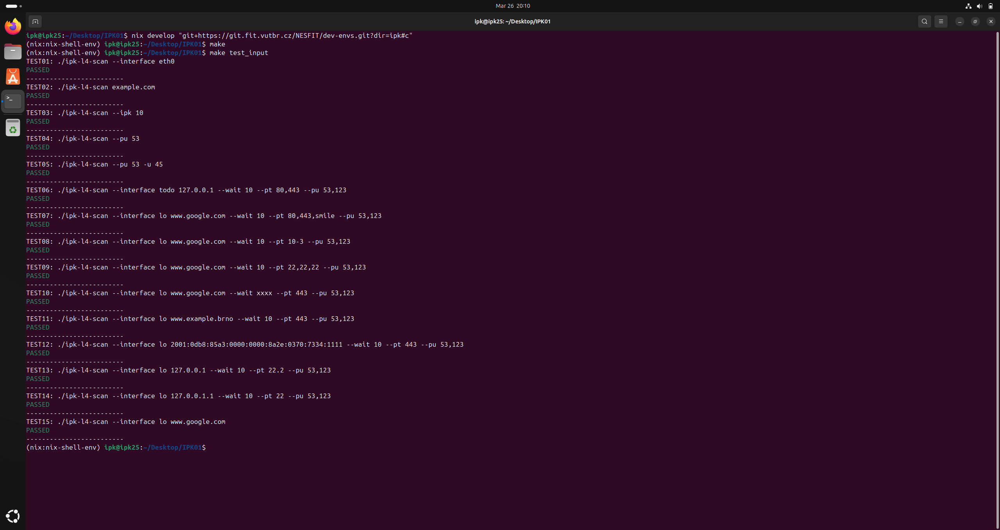
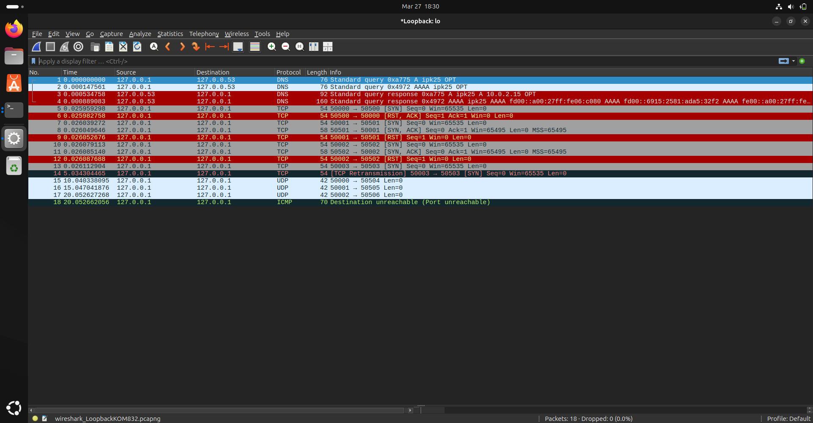
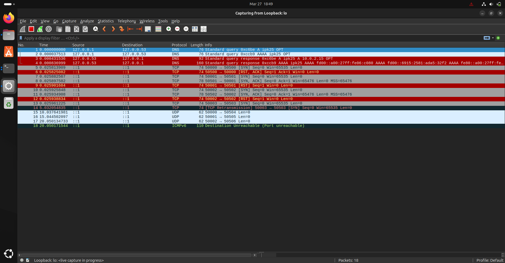
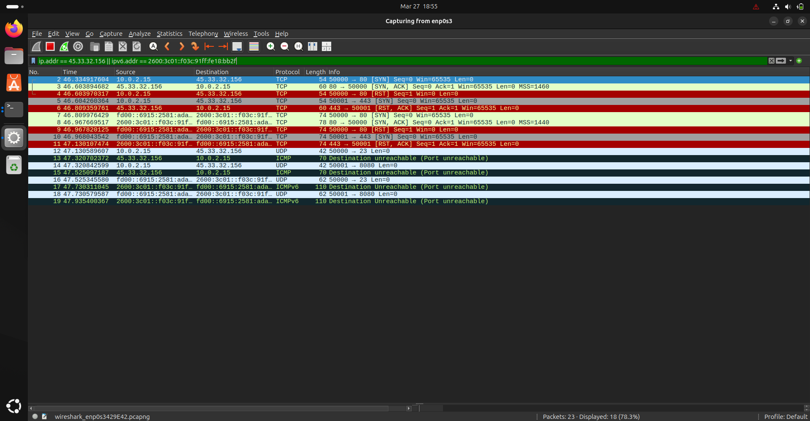
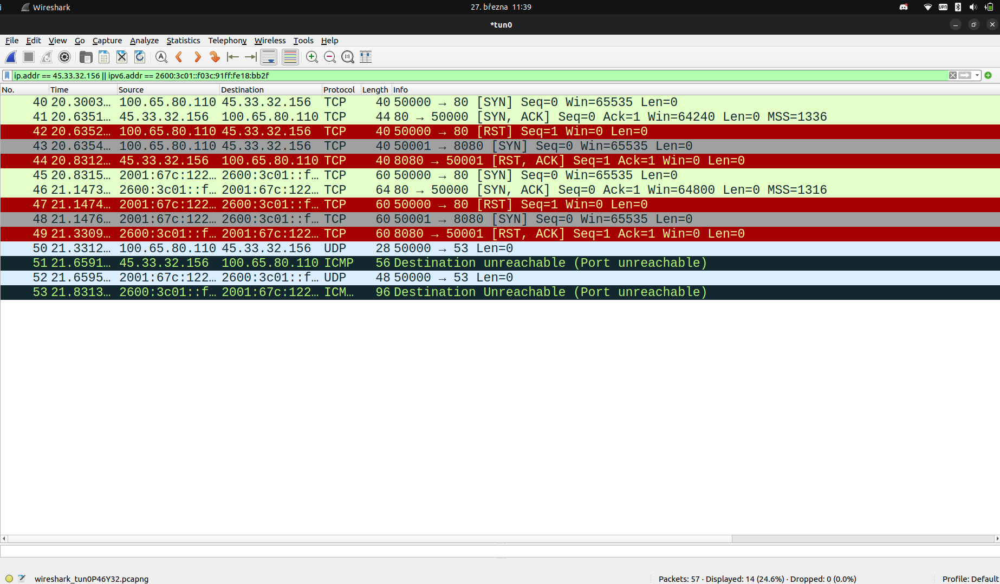
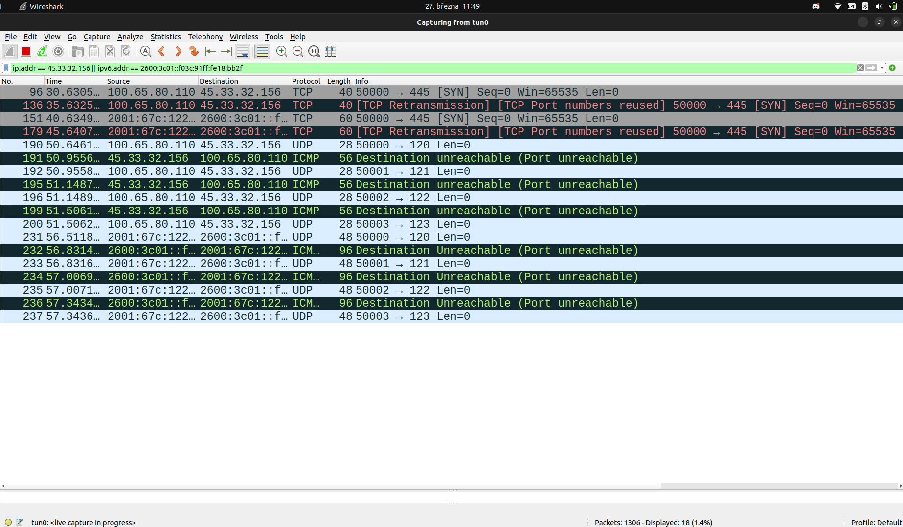
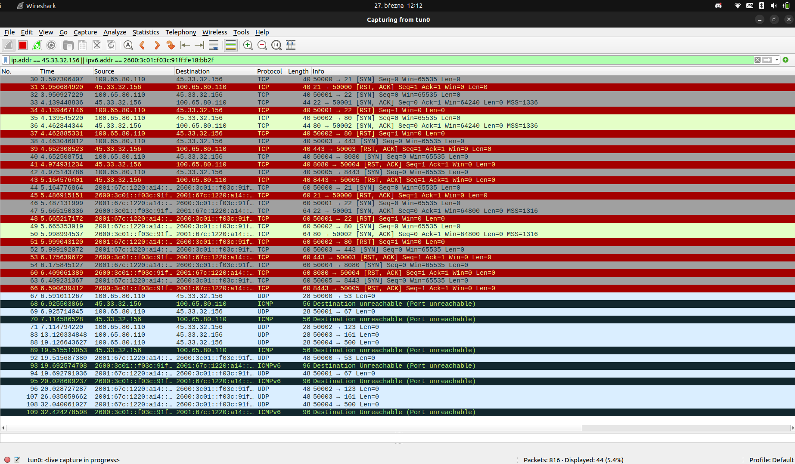

# Dokumentace k prvnímu projektu do předmětu IPK

- Autor: **Martin Zůbek**
- Login: **x253206**
- Varianta: **OMEGA: L4 Scanner**

## Obsah

- [Dokumentace k prvnímu projektu do předmětu IPK](#dokumentace-k-prvnímu-projektu-do-předmětu-ipk)
  - [Obsah](#obsah)
  - [1. Úvod](#1-úvod)
  - [2. Teoretický úvod k projektu](#2-teoretický-úvod-k-projektu)
    - [2.1 L4 síťový skener](#21-l4-síťový-skener)
    - [2.2 Protokol](#22-protokol)
    - [2.3 Protokoly TCP a UDP](#23-protokoly-tcp-a-udp)
      - [2.3.1 TCP (Transmission Control Protocol)](#231-tcp-transmission-control-protocol)
      - [2.3.2 UDP (User Datagram Protocol)](#232-udp-user-datagram-protocol)
    - [2.4 IPv4 a IPv6](#24-ipv4-a-ipv6)
    - [2.5 ICMP (Internet Control Message Protocol)](#25-icmp-internet-control-message-protocol)
    - [2.6 Sokety](#26-sokety)
  - [3. Struktura programu](#3-struktura-programu)
    - [3.1 Přehled souborové struktury](#31-přehled-souborové-struktury)
    - [3.2 Návrh programu v UML diagramu tříd](#32-návrh-programu-v-uml-diagramu-tříd)
    - [3.3 Implementace skenování](#33-implementace-skenování)
    - [3.4 Popis jednotlivých zdrojových souborů](#34-popis-jednotlivých-zdrojových-souborů)
    - [3.5 Návratové hodnoty programu](#35-návratové-hodnoty-programu)
  - [4. Sestavení a spuštění programu](#4-sestavení-a-spuštění-programu)
    - [4.1 Výpis nápovědy](#41-výpis-nápovědy)
    - [4.2 Výpis dostupných síťových rozhraní](#42-výpis-dostupných-síťových-rozhraní)
    - [4.3 Provedení skenu](#43-provedení-skenu)
  - [5. Testování](#5-testování)
    - [5.1 Testování nevalidních vstupů](#51-testování-nevalidních-vstupů)
    - [5.2 Testování na virtuálním stroji](#52-testování-na-virtuálním-stroji)
    - [5.3 Testování na fyzickém stroji](#53-testování-na-fyzickém-stroji)
  - [6. Bibliografie](#6-bibliografie)

## 1. Úvod

Tento projekt představuje implementaci L4 síťového skeneru v jazyce **C++ se standartem 20**. Úkolem  L4 síťového skeneru je detekovat stav síťových portů (open, filtred, closed) pro zadanou doménu a to pomocí TCP nebo UDP protokolu.
Implementace je tvořena pomocí nízkoúrovňových síťových operací, využívající **RAW sokety** k manuální konstrukci hlaviček u konkrétních protokolů a **epoll** pro efektivní čekání na odpovědi.

## 2. Teoretický úvod k projektu

### 2.1 L4 síťový skener

L4 síťový skener slouží k detekci dostupnosti služeb na konkrétních portech cílových zařízení. Pracuje na transportní vrstvě s protokoly **TCP** a **UDP**. Na základě na jakém protokolu pracuje a přijaté odpovědi je schopen určit stav portů:

- **Open** – port je otevřený a služba je dostupná.
- **Closed** – port je uzavřený a žádná služba neposlouchá.
- **Filtered** – paket byl pravděpodobně odfiltrován.

### 2.2 Protokol

Protokol definuje pravidla řídící syntaxi, sématiku a synchronizaci vzájemné komunikace. **[7]**

### 2.3 Protokoly TCP a UDP

#### 2.3.1 TCP (Transmission Control Protocol)

TCP je spojový protokol transportní vrstvy, který zajišťuje spolehlivé doručení dat mezi dvěma zařízeními. Před samotným přenosem dat vytváří spojení pomocí tzv. **3-way handshake**:

1. Klient odešle paket s příznakem `SYN`.
2. Server odpoví paketem s příznaky `SYN-ACK`.
3. Klient dokončí spojení odpovědí s `ACK`.

Díky tomu je zaručen spolehlivý přenos dat. Pro skenování portů v tomto projektu, je využitá jen část **3-way handshake**. A to na základě odpovědi na packet s příznakem `SYN`:

1. Pokud je obdržena odpověď s příznaky `SYN-ACK`, je zájem o navázání komunikace a port je **otevřený (open)**.
2. Pokud je obdržena odpověď s příznakem `RST`, není zájem o navázání komnikace a port je v tom případě **uzavřený (closed)**.
3. Pokud není získaná odpověď, po vypršení timeout a to ani po **TCP Retransmission** (Opětovném zaslání) je port **filtrovaný (filtered)**.

#### 2.3.2 UDP (User Datagram Protocol)

UDP je bezspojový protokol transportní vrstvy, není spolehlivý jak TCP, nenavazuje **3-way handshake**, ale je rychlejší. Skenování portu na tomto protokulu opět probíhá na základě odpovědi na packet, s příznakem `SYN`:

1. Pokud není obdržena odpověď, port je **otevřený (opened)**.
2. Pokud je přijata odpovídající **ICMPv4** nebo **ICMPv6** zpráva, která signalizuje nedostupnost portu, port je **uzavřený (closed)**.  

### 2.4 IPv4 a IPv6

- **IPv4** - je verze internetového protokolu s **32 bitovými adresami**. Tento protokol je velice rozšířen.
- **IPv6** - je verze internetového protokolu, která je nástupcem **IPv4**, kvůli nedostatku adres. Má **128 bitové adresy**. Tento protokol přínáší určitá zjednodušení oproti **IPv4**.

### 2.5 ICMP (Internet Control Message Protocol)

**ICMP** je protokol **síťové vrstvy**, který se používá k diagnostice a oznamování chyb v síťové komunikaci. Existují dvě verze protokolu ICMP

1. **ICMPv4** - Používá se s protokolem **IPv4**.
2. **ICMPv6** - Používá se s protokolem **IPv6**.

### 2.6 Sokety

Soket je programové komunikační rozhraní pro příjem a odeslání dat po sítí. Soket obsahuje informace potřebné pro přenos dat a datové spojení. **[6]**
V projektu jsou využívány **RAW sockety**, které umožňují přímou manipulaci s pakety na nižší úrovni síťového zásobníku. Díky nim lze nejen číst, ale také ručně vytvářet části síťových paketů.
V rámci tohoto projektu je při každém odeslání paketu ručně sestavena hlavička protokolu **TCP nebo UDP**, včetně výpočtu **kontrolního součtu**. Vytvoření hlavičky **síťové vrstvy (IPv4/IPv6) je ponecháno na operačním systému**.

## 3. Struktura programu

### 3.1 Přehled souborové struktury

Projekt je rozdělen do následující souborové struktury:

```plaintext
IPK01
├── img/                             // Složka s obrázky k dokumentaci a snímky z testování
├── LICENSE                          // Licence projektu
├── CHANGELOG.md                     
├── Makefile                         // Makefile pro sestavení projektu
├── README.md                        // Tato dokumentace
├── src/                             // Zdrojové soubory programu
│   ├── command.cpp                  // Implementace tříd pro vypsání pomocné zprávy a rozhraních
│   ├── command.hpp                  // Deklarace tříd příkazů
│   ├── main.cpp                     // Vstupní bod programu
│   ├── parser_arguments.cpp         // Implementace parsování argumentů
│   ├── parser_arguments.hpp         // Deklarace třídy pro parsování argumentů
│   ├── pseudo_headers.hpp           // Struktury pseudo hlaviček pro výpočet kontrolního součtu
│   ├── return_values.hpp            // Definice návratových hodnot programu
│   ├── scanner.cpp                  // Implementace tříd skenerů pro TCP/UDP nebo IPv4/IPv6
│   ├── scanner.hpp                  // Deklarace abstraktní třídy Scanner její potomků
│   ├── scanner_params.cpp           // Zpracování vstupních parametrů pro skenování
│   └── scanner_params.hpp           // Deklarace pro třídu uchovávající parametry skenování
└── tests/                           // Testovací složka
    ├── parse/
    │   └── parse.sh                 // Testování nevalidních vstupů programu
    ├── ports
        ├── port_clean.sh            // Skript pro úklid testovacího prostředí – odstraní filtrování a uklidí po nc
        └── port_test.sh             // Skript pro nastavení testovacího prostředí – otevře a zfiltruje TCP/UDP porty na lokálním rozhraní
```

### 3.2 Návrh programu v UML diagramu tříd

Následující diagram popisuje strukturu a vztahy mezi jednotlivými třídami programu. Jednotlivé parametry metod, nebo detailnější dokumentace je uvedena přímo ve zdrojových souborech programu.


Jedná se opravdu spíše o návrh, main je zde ozančen jako `<<interface>>`, ve smyslu jako nějakého vstupního bodu programu.

### 3.3 Implementace skenování

Program využívá **objektově orientovaný návrh**, kde třída `Scanner` definuje společné metody a atributy pro všechny typy skenerů. Její potomci:

- `TcpIpv4Scanner`
- `TcpIpv6Scanner`
- `UdpIpv4Scanner`
- `UdpIpv6Scanner`

implementují konkrétní logiku pro jednotlivé protokoly a verze IP.

**Průběh skenování každého portu:**

1. **Vytvoření RAW socketu**  
   - Pomocí `socket(AF_INET/AF_INET6, SOCK_RAW, IPPROTO_TCP/UDP/ICMP/ICMP6)`  

2. **Nastavení časovače socketu**  
   - Přidání do `epoll` pro asynchronní čekání na odpovědi

3. **Iterace přes IP adresy a porty**  
   Pro každou IP adresu a port:
   - Vytvoří se TCP nebo UDP hlavička
   - Vypočítá se kontrolní součet na základě pseudo hlavičky
   - Paket se odešle přes `sendto()`

4. **Čekání na odpověď**
   - Pomocí `epoll_wait()` s nastaveným timeoutem
   - V případě TCP může následovat **opětovné poslání(TCP retransmise)**

5. **Získání odpovědi přes `recvfrom()`**  
   - Paket je zpracován a analyzován

**Vyhodnocení výsledku pro TCP:**

- příznak `SYN + ACK`, port je  **otevřený (opened)**
- příznak `RST`, port je **uzavřený (closed)**
- žádná odpověď, port je **filtrovaný (filtered)**

**Vyhodnocení výsledk pro UDP:**

- žádná odpověď, port je **otevřený (opened)**
- ICMP odpověď typu **port unreachable**, port je **uzavřený (closed)**

### 3.4 Popis jednotlivých zdrojových souborů

| Soubor                      | Popis                                                                 |
|-----------------------------|------------------------------------------------------------------------|
| `main.cpp`                 | Vstupní bod programu, volá funkce pro výpis nápovědy, rozhraní a spuštění skenování |
| `command.cpp/hpp`          | Obsahuje třídu `Command`, která obstarává logiku výpisu nápovědy a síťových rozhraní |
| `parser_arguments.cpp/hpp` | Implementace a deklarace třídy `ParserArguments`, která zajišťuje načítání a validaci argumentů z příkazové řádky |
| `scanner.cpp/hpp`          | Obsahuje definici abstraktní třídy `Scanner` a implementaci skenerů pro různé protokoly a IP verze |
| `scanner_params.cpp/hpp`   | Obsahuje třídu `ScannerParams`, která validuje vstupní parametry a zároveň uchovává parametry pro skenování |
| `pseudo_headers.hpp`       | Struktury pro vytvoření pseudo hlaviček potřebných k výpočtu kontrolních součtů u TCP/UDP paketů |
| `return_values.hpp`        | Definuje návratové hodnoty programu |

### 3.5 Návratové hodnoty programu

Program definuje tři návratové hodnoty (viz `return_values.hpp`), které informují o průběhu běhu:

| Kód | Význam |
|-----|--------|
| `0` | **Úspěšné ukončení** – Program proběhl bez chyb. |
| `1` | **Neplatné vstupní argumenty** – Program byl spuštěn s chybnými nebo neúplnými argumenty. |
| `99` | **Chyba za běhu** – Během vykonávání došlo k chybě (např. selhání systémového volání, práce se socketem apod.). |

Vykonávání programu je kdykoliv možné přerušit pomocí `ctrl + c`.

## 4. Sestavení a spuštění programu

Pro sestavení programu je připraven `Makefile`, který umožňuje jednoduché přeložení pomocí příkazu:

```bash
make
```

Výsledkem bude spustitelný soubor `ipk-l4-scan` v kořenovém adresáři projektu.

Program se spouští následujícím způsobem:

```bash
./ipk-l4-scan [parametry] <cílová doména>
```

Program poskytuje tři základní funkce: zobrazení nápovědy, výpis dostupných síťových rozhraní a provedení síťového skenu zvolených portů pomocí protokolů TCP nebo UDP.

### 4.1 Výpis nápovědy

```bash
./ipk-l4-scan -h
./ipk-l4-scan --help
```

### 4.2 Výpis dostupných síťových rozhraní

```bash
./ipk-l4-scan
./ipk-l4-scan -i
./ipk-l4-scan --interface
```

### 4.3 Provedení skenu

Provední skenu stavu portů lze provést například pomocí příkladu níže.

```bash
./ipk-l4-scan -i wlp2s0 -t 80,443 www.vut.cz
./ipk-l4-scan -i tun0 --pu 53 ::1 --wait 10000
```

Pro provedení skenu lze užit tyto přepínače:

| Krátký přepínač  | Dlouhý přepínač   | Popis argumentu přepínače    |
|------------------|-------------------|------------------------------|
| `-i`             | `--interface`     | Název síťového rozhraní      |
| `-t`             | `--pt`            | Porty pro TCP skenování      |
| `-u`             | `--pu`            | Porty pro UDP skenování      |
| `-w`             | `--wait`          | Timeout v milisekundách (nepovinný, výchozí hodnota je 5000 ms) |

**Poznámky:**

1. Spuštení programu musí být provedeno s oprávněním `sudo` kvůli vytváření **RAW soketů**.
2. Formáty zadávání portů ze zadání, **nelze kombinovat.**

## 5. Testování

Testování především probíhalo na virtuálním počítači, s operaračním systémem **Ubuntu 64-bit (verze 23)**. Konkrétně ve viruální prostředí **Nix**, poskytnuté od **NESFIT**, které je spustitelné příkazem níže. **[8]**

```bash
nix develop "git+https://git.fit.vutbr.cz/NESFIT/dev-envs.git?dir=ipk#c"
```

Část testování probíhala také **lokálně na fyzickém zařízení**, a to za účelem ověření kompatibility s běžným **Wi-Fi připojením** a **IPv6 tunelem (`tun0`)**. Operační systém fyzického stroje je **Ubuntu 64-bit (verze 22.04)**.
V obou případech, byl použit k validaci výsledků **Wireshark**.

### 5.1 Testování nevalidních vstupů

Testování nevalidních vstupů, bylo vykonáno pomocí bash skriptu v `tests/parse/parse.sh`, pokud je **program sestaven** pomocí `make`, lze tento testovací skript spusit pomocí `Makefile`.

```bash
make test_input
```

Tento skript byl spuštěn jak na lokálním, tak fyzickém stroji.



### 5.2 Testování na virtuálním stroji

Vzhledem k poskytnutému virtuálnímu prostředí bylo možné využít skutečnosti, že na lokálním loopback rozhraní `lo` neběží žádné služby kromě portu **631 (CUPS)**. Všechny ostatní porty tak zůstávají uzavřené(closed), což umožnilo zahrnout v celku spolehlivé testování. Tento stav je doložen pomocí **nástroje ss** **[11]**.

```bash
(nix:nix-shell-env) ipk@ipk25:~/Desktop/IPK01$ ss -tuln | grep 127.0.0.1
tcp   LISTEN 0      4096       127.0.0.1:631        0.0.0.0:
```

```bash
(nix:nix-shell-env) ipk@ipk25:~/Desktop/IPK01$ ss -uln | grep 127.0.0.1
(nix:nix-shell-env) ipk@ipk25:~/Desktop/IPK01$ 
```

```bash
ipk@ipk25:~/Desktop$ ss -tuln | grep '::1'
tcp   LISTEN 0      4096           [::1]:631           [::]:*
```

```bash
ipk@ipk25:~/Desktop$ ss -uln | grep '::1'
ipk@ipk25:~/Desktop$ 

```

Pro účely zautomatizování testování byly vytvořeny dva shellové skripty:

Skript **`port_test.sh`** se nachází ve složce `./tests/ports/` a slouží k vytvoření síťového testovacího prostředí. Pomocí nástrojů `nc` (netcat) **[12]** a `iptables`/`ip6tables` **[13]**:

- otevře zadané TCP a UDP porty na adrese `127.0.0.1` nebo `::1` podle přepínače `-4` nebo `-6`,
- vytvoří dočasné „servery“ naslouchající na vybraných portech (pomocí příkazů `nc -l` a `nc -u -l`),
- aplikuje pravidla firewallu pro simulaci filtrovaných portů (pomocí `iptables -j DROP` nebo `ip6tables -j DROP`),
- umožňuje tak simulovat všechny tři stavy portů: `open`, `closed` a `filtered`.

Skript **`port_clean.sh`** je druhý skript, který prostředí opět vyčistí. Odstraní pravidla přidaná pomocí `iptables` nebo `ip6tables`, ukončí běžící procesy `nc`, které drží otevřené porty, a vrátí testovací prostředí do výchozího stavu.

Oba skripty lze spustit pomocí `make set_virtual_lo_test_4` nebo `make set_virtual_lo_test_6` a uklidit virtuální prostředí pomocí příkazů `make clean_virtual_lo_test_4` a `make clean_virtual_lo_test_6`.

Skript `port_test.sh` nastavuje konkrétní porty s cílem otestovat všechny možné stavy (open, closed, filtered) jak pro TCP, tak UDP protokol. Konkrétní konfigurace portů je následující:

| Port    | Protokol | Stav         | Poznámka                                     |
|---------|----------|--------------|----------------------------------------------|
| 50501   | TCP      | `open`       | Port naslouchá pomocí `nc -l`                |
| 50502   | TCP      | `open`       | Port naslouchá pomocí `nc -l`                |
| 50503   | TCP      | `filtered`   | Paket je zahozen pomocí `iptables -j DROP`   |
| 50504   | UDP      | `filtered`   | Simuluje otevřený port bez odpovědi pro UDP  |
| 50505   | UDP      | `open`       | Port naslouchá pomocí `nc -u -l`             |

Ostaní porty, jsou tedy uzavřené, kromě **portu 631**, jak je ukázáno výše. Následně probíhalo testování jednotlivých portů, lze vidět na ukázkách z testování níže:

```bash
(nix:nix-shell-env) ipk@ipk25:~/Desktop/IPK01$ make      
(nix:nix-shell-env) ipk@ipk25:~/Desktop/IPK01$ make set_virtual_lo_test_4
(nix:nix-shell-env) ipk@ipk25:~/Desktop/IPK01$ sudo ./ipk-l4-scan -i lo -t 50500,50501,50502,50503 -u 50504,50505,50506 localhost
127.0.0.1 50500 tcp closed
127.0.0.1 50501 tcp open
127.0.0.1 50502 tcp open
127.0.0.1 50503 tcp filtered
127.0.0.1 50504 udp open
127.0.0.1 50505 udp open
127.0.0.1 50506 udp closed
```



```bash
(nix:nix-shell-env) ipk@ipk25:~/Desktop/IPK01$ make
(nix:nix-shell-env) ipk@ipk25:~/Desktop/IPK01$ make set_virtual_lo_test_6
(nix:nix-shell-env) ipk@ipk25:~/Desktop/IPK01$ sudo ./ipk-l4-scan -i lo -t 50500,50501,50502,50503 -u 50504,50505,50506 ::1
::1 50500 tcp closed
::1 50501 tcp open
::1 50502 tcp open
::1 50503 tcp filtered
::1 50504 udp open
::1 50505 udp open
::1 50506 udp closed
```



Náslědně byly testovány i přístupy k portům otevřeným pro jiný protokol. K testování bylo také využito druhé pokytnuté rozhraní  `enp0s3` a testovací doména **`scanme.nmap.org`** **[10]** (popsána v další kapitole), níže je uvedena jedna ukázka z tohoto testování:

```bash
(nix:nix-shell-env) ipk@ipk25:~/Desktop/IPK01$ sudo ./ipk-l4-scan -t 80,443 -u 23,8080 -i enp0s3 scanme.nmap.org
45.33.32.156 80 tcp open
45.33.32.156 443 tcp closed
2600:3c01::f03c:91ff:fe18:bb2f 80 tcp open
2600:3c01::f03c:91ff:fe18:bb2f 443 tcp closed
45.33.32.156 23 udp closed
45.33.32.156 8080 udp closed
2600:3c01::f03c:91ff:fe18:bb2f 23 udp closed
2600:3c01::f03c:91ff:fe18:bb2f 8080 udp closed
```



### 5.3 Testování na fyzickém stroji

Pro účely testování mimo virtuální prostředí byla využita **VPN síť FIT VUT**, která umožnila zejména testování funkcionality v rámci **IPv6**.
Dále byla použita veřejně dostupná testovací doména **`scanme.nmap.org`**, kterou poskytuje projekt **Nmap**. Tato doména je určena k ověřování funkčnosti nástrojů pro skenování portů, a je tedy vhodná i pro testování vlastního síťového skeneru.**[10]**  
Níže jsou uvedeny ukázky několika testovacích scénářů a odpovídající výstupy programu.

```bash
martinzubek@martinzubek-Lenovo-ideapad-700-15ISK:~/Plocha/IPK01$ sudo ./ipk-l4-scan -i tun0 --pt 80,8080 -u 53 scanme.nmap.org
45.33.32.156 80 tcp open
45.33.32.156 8080 tcp closed
2600:3c01::f03c:91ff:fe18:bb2f 80 tcp open
2600:3c01::f03c:91ff:fe18:bb2f 8080 tcp closed
45.33.32.156 53 udp closed
2600:3c01::f03c:91ff:fe18:bb2f 53 udp closed
```



```bash
martinzubek@martinzubek-Lenovo-ideapad-700-15ISK:~/Plocha/IPK01$ sudo ./ipk-l4-scan --interface tun0 -t 445 --pu 120-123 scanme.nmap.org
45.33.32.156 445 tcp filtered
2600:3c01::f03c:91ff:fe18:bb2f 445 tcp filtered
45.33.32.156 120 udp closed
45.33.32.156 121 udp closed
45.33.32.156 122 udp closed
45.33.32.156 123 udp open
2600:3c01::f03c:91ff:fe18:bb2f 120 udp closed
2600:3c01::f03c:91ff:fe18:bb2f 121 udp closed
2600:3c01::f03c:91ff:fe18:bb2f 122 udp closed
2600:3c01::f03c:91ff:fe18:bb2f 123 udp open
```



```bash
martinzubek@martinzubek-Lenovo-ideapad-700-15ISK:~/Plocha/IPK01$ sudo ./ipk-l4-scan -i tun0 -t 21,22,80,443,8080,8443 -u 53,67,123,161,500 scanme.nmap.org -w 6000
45.33.32.156 21 tcp closed
45.33.32.156 22 tcp open
45.33.32.156 80 tcp open
45.33.32.156 443 tcp closed
45.33.32.156 8080 tcp closed
45.33.32.156 8443 tcp closed
2600:3c01::f03c:91ff:fe18:bb2f 21 tcp closed
2600:3c01::f03c:91ff:fe18:bb2f 22 tcp open
2600:3c01::f03c:91ff:fe18:bb2f 80 tcp open
2600:3c01::f03c:91ff:fe18:bb2f 443 tcp closed
2600:3c01::f03c:91ff:fe18:bb2f 8080 tcp closed
2600:3c01::f03c:91ff:fe18:bb2f 8443 tcp closed
45.33.32.156 53 udp closed
45.33.32.156 67 udp closed
45.33.32.156 123 udp open
45.33.32.156 161 udp open
45.33.32.156 500 udp closed
2600:3c01::f03c:91ff:fe18:bb2f 53 udp closed
2600:3c01::f03c:91ff:fe18:bb2f 67 udp closed
2600:3c01::f03c:91ff:fe18:bb2f 123 udp open
2600:3c01::f03c:91ff:fe18:bb2f 161 udp open
2600:3c01::f03c:91ff:fe18:bb2f 500 udp closed
```



## 6. Bibliografie

[1] **RFC 793** – DARPA INTERNET PROGRAM. *Transmission Control Protocol* [online]. 1981. Dostupné z: [https://datatracker.ietf.org/doc/html/rfc793](https://datatracker.ietf.org/doc/html/rfc793)

[2] **RFC 768** – POSTEL, Jon. *User Datagram Protocol* [online]. 1980. Dostupné z: [https://datatracker.ietf.org/doc/html/rfc768](https://datatracker.ietf.org/doc/html/rfc768)

[3] **RFC 792** – POSTEL, Jon. *Internet Control Message Protocol* [online]. 1981. Dostupné z: [https://datatracker.ietf.org/doc/html/rfc792](https://datatracker.ietf.org/doc/html/rfc792)

[4] **RFC 791** – *Internet Protocol* [online]. 1981. Dostupné z: [https://datatracker.ietf.org/doc/html/rfc791](https://datatracker.ietf.org/doc/html/rfc791)

[5] **RFC 8200** – *Internet Protocol, Version 6 (IPv6) Specification* [online]. 2017. Dostupné z: [https://datatracker.ietf.org/doc/html/rfc8200](https://datatracker.ietf.org/doc/html/rfc8200)

[6] **OUTRATA, Jan**. *Sokety - POSIX* [online]. [cit. 2025-03-27]. Dostupné z: [http://outrata.inf.upol.cz/courses/pos/sockets.html](http://outrata.inf.upol.cz/courses/pos/sockets.html)

[7] **Wikipedie**. *Protokol (informatika)*. In: *Wikipedie: Otevřená encyklopedie* [online]. [cit. 2025-03-27]. Dostupné z: [https://cs.wikipedia.org/wiki/Protokol_(informatika)](https://cs.wikipedia.org/wiki/Protokol_(informatika))

[8] **FIT VUT**. *NESFIT - dev-envs: Vývojová prostředí* [online]. [cit. 2025-03-27]. Dostupné z: [https://git.fit.vutbr.cz/NESFIT/dev-envs](https://git.fit.vutbr.cz/NESFIT/dev-envs)

[9] **FIT VUT**. *NESFIT - IPK Projects, OMEGA* [online]. Dostupné z: [https://git.fit.vutbr.cz/NESFIT/IPK-Projects/src/branch/master/Project_1/omega](https://git.fit.vutbr.cz/NESFIT/IPK-Projects/src/branch/master/Project_1/omega)

[10] **NMAP.org**. *Scanme.nmap.org – Testovací server pro síťové skenery* [online]. Dostupné z: [http://scanme.nmap.org/](http://scanme.nmap.org/)

[11] **MAN7**. *ss(8) - Linux manual page* [online]. Dostupné z: [https://man7.org/linux/man-pages/man8/ss.8.html](https://man7.org/linux/man-pages/man8/ss.8.html)

[12] **DIE.NET**. *nc(1) - Linux man page* [online]. Dostupné z: [https://linux.die.net/man/1/nc](https://linux.die.net/man/1/nc)

[13] **UBUNTU MANPAGES**. *iptables(8) — Linux manual page* [online]. Dostupné z: [https://manpages.ubuntu.com/manpages/focal/man8/iptables.8.html](https://manpages.ubuntu.com/manpages/focal/man8/iptables.8.html)
