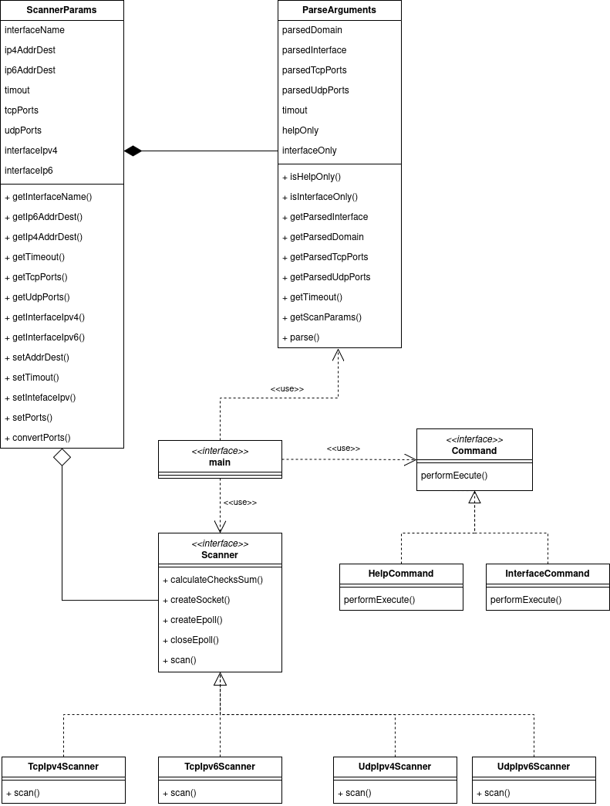

# Dokumentace k prvnímu projektu do předmětu IPK

- Autor: **Martin Zůbek**
- Login: **x253206**
- Varianta: **OMEGA: L4 Scanner**

## Obsah

- [Dokumentace k prvnímu projektu do předmětu IPK](#dokumentace-k-prvnímu-projektu-do-předmětu-ipk)
  - [Obsah](#obsah)
  - [1. Úvod](#1-úvod)
  - [2. Teoretický úvod k projektu](#2-teoretický-úvod-k-projektu)
    - [2.1 L4 síťový skener](#21-l4-síťový-skener)
    - [2.2 Protokol](#22-protokol)
    - [2.3 Protokoly TCP a UDP](#23-protokoly-tcp-a-udp)
      - [2.3.1 TCP (Transmission Control Protocol)](#231-tcp-transmission-control-protocol)
      - [2.3.2 UDP (User Datagram Protocol)](#232-udp-user-datagram-protocol)
    - [2.4 IPv4 a IPv6](#24-ipv4-a-ipv6)
    - [2.5 ICMP (Internet Control Message Protocol)](#25-icmp-internet-control-message-protocol)
    - [2.6 Sokety](#26-sokety)
  - [3. Struktura programu](#3-struktura-programu)
    - [3.1 Přehled souborové struktury](#31-přehled-souborové-struktury)
    - [3.2 Návrh programu v UML diagramu tříd](#32-návrh-programu-v-uml-diagramu-tříd)
    - [3.3 Implementace a logika skenování](#33-implementace-a-logika-skenování)
    - [3.4 Popis jednotlivých zdrojových souborů](#34-popis-jednotlivých-zdrojových-souborů)
  - [4. Sestavení a spuštění programu](#4-sestavení-a-spuštění-programu)
    - [4.1 Výpis nápovědy](#41-výpis-nápovědy)
    - [4.2 Výpis dostupných sířových rozhraní](#42-výpis-dostupných-sířových-rozhraní)
    - [4.3 Provedení skenu](#43-provedení-skenu)
  - [5. Testování](#5-testování)
  - [6. Bibliografie](#6-bibliografie)

## 1. Úvod

Tento projekt představuje implementaci L4 síťového skeneru v jazyce **C++**. Úkolem  L4 síťového skeneru je detekovat stav síťových portů (open, filtred, closed) pro zadanou doménu a to pomocí TCP nebo UDP protokolu.
Implementace je tvořena pomocí nízkoúrovňových sítivoých operací, využívající **RAW sokety** k manuální kosnstrukci hlaviček u konkrétních protokolů a **epoll** pro efektivní čekání na odpovědi.

## 2. Teoretický úvod k projektu

### 2.1 L4 síťový skener

L4 síťový skener slouží k detekci dostupnosti služeb na konkrétních portech cílových zařízení. Pracuje na transportní vrstvě s ptokololy **TCP** a **UDP**. Na základě na jakém protokolu pracuje a přijaté odpovědi je schopen určit stav portů:

- **Open** – port je otevřený a služba je dostupná.
- **Closed** – port je uzavřený a žádná služba neposlouchá.
- **Filtered** – paket byl pravděpodobně odfiltrován firewallem .

### 2.2 Protokol

Protokol definuje pravidla řídící syntaxi, sématiku a synchronizaci vzájemné komunikace.

### 2.3 Protokoly TCP a UDP

#### 2.3.1 TCP (Transmission Control Protocol)

TCP je spojový protokol transportní vrstvy, který zajišťuje spolehlivé doručení dat mezi dvěma zařízeními. Před samotným přenosem dat vytváří spojení pomocí tzv. **3-way handshake**:

1. Klient odešle paket s příznakem `SYN`.
2. Server odpoví paketem s příznaky `SYN-ACK`.
3. Klient dokončí spojení odpovědí s `ACK`.

Díky tomu je zaručen spolehlivý přenos dat. Pro skenování portů, v tomto projektu, je využitá jen část **3-way handshake**. A to na základě odpovědi na packet s příznakem `SYN`:

1. Pokud je obdržena odpověď s příznaky `SYN-ACK`, je zájem o navázání komunikace a port je **otevřený (open)**.
2. Pokud je obdržena odpověď s příznakem `RST`, není zájem o navázání komnikace a port je v tom případě **uzavřený (closed)**.
3. Pokud není získaná odpoveď, po vypršení timeout a to ani po **TCP Retransmission** (Opětovném zaslní) je port **filtrovaný (filtered)**.

#### 2.3.2 UDP (User Datagram Protocol)

UDP je bezspojový protokol transportní vrstvy, není spolehlivý jak TCP, nanavazuje **3-way handshake**, ale je rychlejší. Skenování port na tomto protokulu, opět probíhá na základě odpovědi na packet s příznakem `SYN`:

1. Pokud není obdržena odpověď, port je **otevřený (opened)**.
2. Pokud je přijata odpovídající **ICMPv4** nebo **ICMPv6** zpráva, která signalizuje nedostupnost portu, port je **uzavřený (closed)**.  

### 2.4 IPv4 a IPv6

- **IPv4** - je verze internetového protokolu s **32 bitovými adresami**. Tento protokol je velice rozšířen.
- **IPv6** - je verze internetového protokolu, která je nástupcem **IPv4** kvůli nedostatku adres. Má **128 bitové adresy**. Tento protokol přínáší určitá zjednodušení oproti **IPv4**.

### 2.5 ICMP (Internet Control Message Protocol)

**ICMP** je protokol **síťové vrstvy**, který se používá k diagnostice a oznamování chyb v síťové komunikaci. Existují dvě verze protokolu ICMP

1. **ICMPv4** - Používá se s protokolem **IPV4**.
2. **ICMPv6** - Používá se s protokolem **IPv6**.

### 2.6 Sokety

Soket je programové komunikační rozhraní uzluz pro příjem a odeslání dat po sítí. Soket obsahuje informace potřené pro pro přenos dat a datové spojení.
V projektu jsou využívány **RAW sockety**, které umožňují přímou manipulaci s pakety na nižší úrovni síťového zásobníku. Díky nim lze nejen číst, ale také ručně vytvářet části síťových paketů.
V rámci tohoto projektu je při každém odeslání paketu ručně sestavena hlavička protokolu **TCP nebo UDP**, včetně výpočtu **kontrolního součtu**. Vytvoření hlavičky **síťové vrstvy (IPv4/IPv6) je ponecháno na operačním systému**.

## 3. Struktura programu

### 3.1 Přehled souborové struktury

Projekt je rozdělen do následující souborové struktury:

```plaintext
.
├── img/
│   └── ipk_l4_scan.drawio.png       // UML diagram tříd
├── LICENSE                          // Licence projektu
├── CHANGELOG.md                     
├── Makefile                         // Makefile pro sestavení projektu
├── README.md                        // Tato dokumentace
├── src/                             // Zdrojové soubory programu
│   ├── command.cpp                  // Implementace příkazů help výpisu tříd
│   ├── command.hpp                  // Deklarace tříd příkazů
│   ├── main.cpp                     // Vstupní bod programu
│   ├── parser_arguments.cpp         // Implementace parsování argumentů
│   ├── parser_arguments.hpp         // Deklarace třídy pro parsování argumentů
│   ├── pseudo_headers.hpp           // Struktury pseudo hlaviček pro výpočet checksum
│   ├── return_values.hpp            // Definice návratových hodnot programu
│   ├── scanner.cpp                  // Implementace tříd skenerů pro TCP/UDP nebo IPv4/IPV6
│   ├── scanner.hpp                  // Deklarace abstraktní trídy Scanner její potmků
│   ├── scanner_params.cpp           // Zpracování vstupních parametrů pro skenování
│   └── scanner_params.hpp           // Deklarace pro třídu uchovávající parametry skenování
└── tests/                           // Testovací složka
    ├── parse/
    │   └── parse.sh                 // Testování nevalidních vstupů programu
    └── wireshark/                   // Záznamy z ověření funkčnosti programu z Wiresharku
```

### 3.2 Návrh programu v UML diagramu tříd

Následující diagram popisuje strukturu a vztahy mezi jednotlivými třídami programu. Jednotlivé parametry metod, nebo detailnější dokumentace je uvedena přímo ve zdrojových souborech programu.



### 3.3 Implementace a logika skenování

Program využívá **objektově orientovaný návrh**, kde třída `Scanner` definuje společné metody a atributy pro všechny typy skenerů. Její potomci:

- `TcpIpv4Scanner`
- `TcpIpv6Scanner`
- `UdpIpv4Scanner`
- `UdpIpv6Scanner`

implementují konkrétní logiku pro jednotlivé protokoly a verze IP.

**Průběh skenování každého portu:**

1. **Vytvoření RAW socketu**  
   - Pomocí `socket(AF_INET/AF_INET6, SOCK_RAW, IPPROTO_TCP/UDP/ICMP/ICMP6)`  
   - Umožňuje přímou práci s hlavičkami paketů

2. **Nastavení socketu jako neblokujícího**  
   - Přidání do `epoll` pro asynchronní čekání na odpovědi

3. **Iterace přes IP adresy a porty**  
   Pro každou IP adresu a port:
   - Vytvoří se TCP nebo UDP hlavička
   - Vypočítá se kontrolní součet na základě pseudo hlavičky
   - Paket se odešle přes `sendto()`

4. **Čekání na odpověď**
   - Pomocí `epoll_wait()` s nastaveným timeoutem
   - V případě TCP může následovat **TCP retransmise(opětovné poslání)**

5. **Získání odpovědi přes `recvfrom()`**  
   - Paket je zpracován a analyzován

**Vyhodnocení výsledku pro TCP:**

- příznak `SYN + ACK`, port je  **otevřený (opened)**
- příznak `RST`, port je **uzavřený (closed)**
- žádná odpověď, port je **filtrovaný (filtered)**

**Pro UDP:**

- žádná odpověď, port je **otevřený (opened)**
- ICMP odpověď typu "port unreachable, port je **uzavřený (closed)**

### 3.4 Popis jednotlivých zdrojových souborů

| Soubor                      | Popis                                                                 |
|-----------------------------|------------------------------------------------------------------------|
| `main.cpp`                 | Vstupní bod programu, volá funkce pro výpis nápovědy, rozhraní a spuštění skenování |
| `command.cpp/hpp`          | Obsahuje třídu `Command`, která obstarává logiku výpisu nápovědy a síťových rozhraní |
| `parser_arguments.cpp/hpp` | Implementace a deklarace třídy `ParserArguments`, která zajišťuje načítání a validaci argumentů z příkazové řádky |
| `scanner.cpp/hpp`          | Obsahuje definici abstraktní třídy `Scanner` a implementaci skenerů pro různé protokoly a IP verze |
| `scanner_params.cpp/hpp`   | Obsahuje třídu `ScannerParams`, která validuje vstupní parametry a zárpveň uchovává parametry pro skenování |
| `pseudo_headers.hpp`       | Struktury pro vytvoření pseudo hlaviček potřebných k výpočtu kontrolních součtů u TCP/UDP paketů |
| `return_values.hpp`        | Definuje návratové hodnoty programu |

## 4. Sestavení a spuštění programu

Pro sestavení programu je připraven `Makefile`, který umožňuje jednoduché přeložení pomocí příkazu:

```bash
make
```

Výsledkem bude spustitelný soubor `ipk-l4-scan` v kořenovém adresáři projektu.

Program se spouští následujícím způsobem:

```bash
./ipk-l4-scan [parametry] <cílová doména>
```

Program poskytuje tři základní funkce: zobrazení nápovědy, výpis dostupných síťových rozhraní a provedení síťového skenu zvolených portů pomocí protokolů TCP nebo UDP.

### 4.1 Výpis nápovědy

```bash
./ipk-l4-scan -h
./ipk-l4-scan --help
```

### 4.2 Výpis dostupných sířových rozhraní

```bash
./ipk-l4-scan
./ipk-l4-scan -i
./ipk-l4-scan --interface
```

### 4.3 Provedení skenu

Provední skenu stavu portů lze provést například pomocí příkladu níže.

```bash
./ipk-l4-scan -i wlp2s0 -t 80,443 www.vut.cz
./ipk-l4-scan -i tun0 --pu 53 ::1 --wait 10000
```

Pro provedení skenu lze užit tyto přepínače:

| Krátký přepínač  | Dlouhý přepínač   | Popis argumentu přepínače    |
|------------------|-------------------|------------------------------|
| `-i`             | `--interface`     | Název síťového rozhraní      |
| `-t`             | `--pt`            | Porty pro TCP skenování      |
| `-u`             | `--pu`            | Porty pro UDP skenování      |
| `-w`             | `--wait`          | Timeout ve stovkách milisekund (nepovinný, výchozí hodnota je 5000 ms) |

Spuštení programu musí být provedeno s oprávněnm `sudo` kvůli vytváření **RAW soketů**.

## 5. Testování

## 6. Bibliografie
